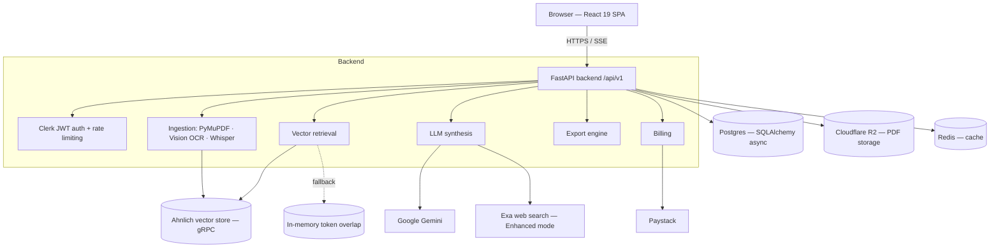

# SIFT.AI

**AI legal research assistant for Nigerian legal professionals and law students.**
Upload your own documents, ask questions in plain English, and get answers grounded in *your* files — every claim backed by a clickable citation that highlights the exact paragraph in the source PDF, formatted in Nigerian citation style, and never used to train a model.

> **Status:** working full-stack MVP — **42 API endpoints** across 12 routers, **190 automated tests**, real Ahnlich vector retrieval over gRPC, live SSE streaming chat, and a functioning PDF-highlight viewer.

---

## Table of contents

- [What it does](#what-it-does)
- [Key features](#key-features)
- [Architecture](#architecture)
- [How retrieval works (the RAG pipeline)](#how-retrieval-works-the-rag-pipeline)
- [Tech stack](#tech-stack)
- [Repository structure](#repository-structure)
- [API overview](#api-overview)
- [Getting started](#getting-started)
- [Environment variables](#environment-variables)
- [Testing](#testing)
- [Deployment](#deployment)
- [Data model](#data-model)
- [Security & compliance](#security--compliance)
- [Further documentation](#further-documentation)

---

## What it does

General AI chatbots *sound* confident but invent case names and citations — in legal practice, a hallucinated citation is a professional-conduct risk, not a harmless bug. SIFT.AI solves this with **verifiable, grounded answers**:

1. You **bring your own material** — PDFs, Word docs, scanned images (OCR), even audio (transcribed).
2. You **organize by matter** (a case/client workspace); teams collaborate inside a **chambers**.
3. You **ask** — the answer **streams in live**, citing only your documents.
4. You **verify** — click any citation and the source PDF opens with the exact paragraph highlighted.
5. You **choose rigour** — **Strict mode** answers only from your documents; **Enhanced mode** adds current web context.
6. You **deliver** — export a court-ready memo to PDF / DOCX / PPTX in one click.

The primary audience is **individual legal professionals and law students** (lawyers, paralegals, legal researchers, trainees, students). **Chambers** is the team layer for groups who collaborate on shared matters.

---

## Key features

- **Grounded RAG chat** — answers synthesized only from retrieved document chunks, streamed token-by-token over SSE.
- **Paragraph-level verifiability** — citations map to a document, page, and bounding box; the frontend PDF viewer highlights the exact region.
- **Nigerian legal formatting** — citation grammar (NWLR, `[SC]`/`[CA]`/`[FHC]`) and conflict detection with confidence scoring.
- **Ahnlich vector search** — semantic retrieval over gRPC with per-user / per-chambers metadata isolation, plus an automatic in-memory fallback.
- **Multi-modal ingestion** — PDF & DOCX parsing, **Gemini Vision OCR** for images, **Faster-Whisper** transcription for audio.
- **Matters & chambers** — organize work by case; team accounts with roles, invites, and seat limits.
- **Exports** — server-side memo/brief generation (reportlab / python-docx / python-pptx).
- **Billing** — Paystack subscription tiers (mocked when unconfigured).
- **Auth** — Clerk JWT verification with a guest mode; per-user rate limiting.
- **Privacy/NDPA** — machine-readable policy, real "delete my data" erasure across stores, no-training guarantee.

---

## Architecture



**Flow in one line:** the React SPA calls the FastAPI API; documents are chunked, embedded, and stored in **Ahnlich**; a question retrieves the most relevant chunks (scoped to the user) and feeds them to **Gemini**, which streams back a grounded, cited answer.

---

## How retrieval works (the RAG pipeline)

**On upload**
1. The document is parsed (PyMuPDF for PDFs, Gemini Vision for images, Whisper for audio) and split into chunks (`langchain-text-splitters`).
2. Each chunk is embedded with the `all-MiniLM-L6-v2` model.
3. Vectors are written to an **Ahnlich store over gRPC**, tagged with metadata (user id, document id).

**On a question**
4. The query is embedded into a vector.
5. Ahnlich runs a **cosine-similarity search (`get_sim_n`)** — semantic, not keyword.
6. A **metadata-predicate filter** restricts results to the requesting user's files (and their chambers) — hard tenant isolation.
7. The top chunks — and only those — are passed to Gemini for synthesis, so answers stay grounded.

If Ahnlich is unreachable, the service **degrades to an in-memory token-overlap fallback** instead of failing.

---

## Tech stack

**Backend**
- **FastAPI** (`fastapi[standard]`), Python ≥ 3.9, `uvicorn`
- **SQLAlchemy 2 (async)** + `asyncpg` / `psycopg` → Postgres (with in-memory fallback registries)
- **Ahnlich** (`ahnlich-client-py`, `grpclib`) — vector database
- **Google Gemini** via `langchain-google-genai` (default `gemini-3.7-flash`)
- **Exa** (`exa-py`) — web search for Enhanced mode
- **Faster-Whisper** — audio transcription
- **PyMuPDF** — PDF parsing; **reportlab / python-docx / python-pptx** — exports
- **Redis** — search-result cache; **boto3** — Cloudflare R2 (S3-compatible) storage
- **PyJWT** — Clerk token verification; **sse-starlette** — streaming
- **httpx** — Paystack checkout/webhook

**Frontend**
- **React 19** + **Vite 8** + **Tailwind CSS 4**
- **Zustand 5** (state), **React Router 7**
- **@clerk/react** (auth), **pdfjs-dist 6** (PDF highlight viewer)
- **react-markdown** + **remark-gfm**, **framer-motion**, **react-dropzone**, **lucide-react**

**Infra**
- Docker + docker-compose (backend and frontend); Render (`render.yaml`) for the backend web service

---

## Repository structure

```
SIFT.AI/
├── render.yaml                 # Render deployment (backend web service)
├── PRESENTATION_DEFENSE.md     # Presentation speaker guide
├── SIFT_AI_MASTER_BRIEF.md     # System briefing / talking points
├── backend/
│   ├── app/
│   │   ├── main.py             # FastAPI app, router wiring, lifespan
│   │   ├── api/routes/         # 12 routers (health, documents, chat, chats,
│   │   │                       #   matters, chambers, billing, exports,
│   │   │                       #   audio, audit, me, privacy)
│   │   ├── services/           # vector_store, llm_synthesis, web_search,
│   │   │                       #   agent_router, entitlements, export_service,
│   │   │                       #   image_extraction, storage, cache
│   │   └── db/                 # models.py, session.py, *_registry.py
│   ├── tests/                  # pytest suite (190 tests)
│   ├── pyproject.toml          # dependencies + pytest config
│   ├── Makefile                # install / dev / test / run / docker targets
│   ├── Dockerfile · docker-compose.yml
│   └── .env.example            # documented environment variables
└── frontend/
    ├── src/
    │   ├── main.jsx · App.jsx
    │   ├── Pages/              # routed pages
    │   ├── components/         # auth · chat · composer · documents · layout · theme · ui · upload
    │   └── lib/                # API client, helpers
    ├── package.json · vite.config.js
    ├── Dockerfile · docker-compose.yml
    └── .env                    # VITE_* frontend config
```

---

## API overview

Base path: **`/api/v1`** · Interactive docs at **`/docs`** (Swagger) when the server is running · Health check at **`/api/v1/health`**.

| Router | Endpoints | Purpose |
|---|---:|---|
| `health` | 2 | Liveness / readiness |
| `me` | 2 | Current user profile (get / update) |
| `documents` | 5 | Upload, list, fetch file, delete |
| `chat` | 1 | Grounded chat (SSE streaming) |
| `chats` | 6 | Chat session CRUD + messages |
| `matters` | 9 | Matter workspaces + nested resources |
| `chambers` | 7 | Team accounts, membership, invites |
| `billing` | 5 | Paystack plans, checkout, webhook, status |
| `exports` | 1 | Memo/brief export (PDF/DOCX/PPTX) |
| `audio` | 1 | Whisper transcription |
| `audit` | 1 | Audit-log access |
| `privacy` | 2 | NDPA policy + delete-my-data |
| **Total** | **42** | |

---

## Getting started

### Prerequisites
- **Python 3.9+** and **Node.js 18+**
- Optional (features degrade gracefully without them): a Gemini API key, an Ahnlich endpoint, Postgres, Redis, Cloudflare R2, Exa, Clerk, Paystack.

### Backend

```bash
cd backend
make venv          # create .venv
make install       # pip install -e ".[dev]"
cp .env.example .env   # then fill in the values you have
make dev           # FastAPI dev server (hot reload)
# or:  make run    # uvicorn app.main:app on :8000
```

The API is then at `http://localhost:8000` with docs at `http://localhost:8000/docs`.
For local development without Clerk, set `AUTH_ENABLED=false` (treats all requests as a fixed dev user) and `RATE_LIMIT_ENABLED=false`.

### Frontend

```bash
cd frontend
npm install
# create .env with the VITE_ values (API base URL, Clerk publishable key)
npm run dev        # Vite dev server (default http://localhost:5173)
npm run build      # production build to dist/
```

### Docker

```bash
# Backend
cd backend && make docker-compose-up      # docker compose up --build

# Frontend
cd frontend && docker compose up --build
```

---

## Environment variables

Configured in `backend/.env` (see `backend/.env.example` for the fully documented list). **The app boots and degrades gracefully when optional services are unset.**

| Variable | Required for | Notes |
|---|---|---|
| `GEMINI_API_KEY` | Chat | Without it, chat returns a "service unavailable" message |
| `DEFAULT_LLM_MODEL` | Chat | Defaults to `gemini-3.7-flash`; auto-fails-over through a fallback list |
| `EXA_API_KEY` | Enhanced mode | Without it, answers use documents only |
| `AHNLICH_ENDPOINT` / `AHNLICH_HOST` / `AHNLICH_PORT` | Vector search | Falls back to in-memory retrieval when unreachable |
| `DATABASE_URL` | Persistence | Any Postgres URL (e.g. Neon pooled); in-memory registries otherwise |
| `REDIS_URL` | Caching | Optional; leave blank to disable |
| `R2_ENDPOINT_URL` / `R2_ACCESS_KEY_ID` / `R2_SECRET_ACCESS_KEY` / `R2_BUCKET_NAME` | PDF storage | All required to enable; otherwise file serving is disabled |
| `CLERK_JWKS_URL` / `CLERK_ISSUER` / `CLERK_AUTHORIZED_PARTIES` | Auth | JWT verification; set `AUTH_ENABLED=false` only for local dev |
| `CORS_ALLOWED_ORIGINS` | Browser access | Comma-separated frontend origins |
| `RATE_LIMIT_ENABLED` / `RATE_LIMIT_PER_MINUTE` | Abuse protection | Per-user; defaults to 30/min |
| `WHISPER_MODEL_SIZE` / `WHISPER_DEVICE` / `WHISPER_COMPUTE_TYPE` | Transcription | Faster-Whisper tuning |
| `MAX_UPLOAD_SIZE_BYTES` | Uploads | Server-enforced; defaults to 20 MB |

The frontend reads `VITE_`-prefixed variables from `frontend/.env` (API base URL and Clerk publishable key).

---

## Testing

```bash
cd backend
make test          # python -m pytest
```

The suite has **190 test functions across 23 files** under `backend/tests/`, covering routes, services (retrieval, synthesis, exports, billing), auth, and the fallback paths. `pytest` is configured in `pyproject.toml` (`asyncio_mode = "auto"`).

---

## Deployment

- **Backend → Render:** `render.yaml` defines a Dockerized web service (`rootDir: backend`, health check `/api/v1/health`). Secrets (`GEMINI_API_KEY`, `DATABASE_URL`, `CLERK_*`, `R2_*`, etc.) are set as unsynced env vars in the Render dashboard.
- **Docker:** both `backend/` and `frontend/` ship a `Dockerfile` and `docker-compose.yml`.
- **Frontend:** `npm run build` produces a static `dist/` bundle deployable to any static host / CDN.

---

## Data model

Eight core entities (SQLAlchemy models in `backend/app/db/models.py`), backed by Postgres with in-memory registry fallbacks:

- **DocumentRecord** — uploaded documents and metadata
- **UserProfile** — user + role (Principal Partner/SAN, Partner, Associate, NYSC Trainee, Law Student)
- **Chambers** / **ChambersMembership** — team accounts and their members
- **Matter** — case/client workspace (personal or chambers-scoped)
- **Subscription** — Paystack billing tier
- **UsageEvent** — metered usage (e.g. exports)
- **AuditLog** — audit trail

---

## Security & compliance

- **Authentication:** Clerk JWT verification (JWKS signature check, issuer + authorized-party validation), with a guest/dev mode.
- **Rate limiting:** per-authenticated-user, configurable, on chat/upload/search.
- **Tenant isolation:** vector retrieval is metadata-filtered per user (and per chambers).
- **NDPA alignment:** machine-readable privacy policy endpoint, a real delete-my-data erasure across all stores, encryption in transit/at rest, and a no-training guarantee.

---

## Further documentation

| Document | What's in it |
|---|---|
| [backend/README.md](backend/README.md) | Backend quickstart |
| [backend/HUMAN_RUNBOOK.md](backend/HUMAN_RUNBOOK.md) | Operational runbook |
| [backend/BACKEND_DEV2_HANDOFF.md](backend/BACKEND_DEV2_HANDOFF.md) | Backend handoff notes |
| [frontend/FRONTEND_INTEGRATION.md](frontend/FRONTEND_INTEGRATION.md) | Frontend ↔ API integration |
| [frontend/CLERK_AUTH_INTEGRATION.md](frontend/CLERK_AUTH_INTEGRATION.md) | Clerk auth wiring |
| [frontend/BILLING_CALLBACK_FLOW.md](frontend/BILLING_CALLBACK_FLOW.md) | Paystack billing callback flow |
| [PRESENTATION_DEFENSE.md](PRESENTATION_DEFENSE.md) | Presentation & defense speaker guide |
| [SIFT_AI_MASTER_BRIEF.md](SIFT_AI_MASTER_BRIEF.md) | Full system briefing / talking points |

---

*SIFT.AI — grounded, verifiable, Nigerian, compliant. General AI guesses; SIFT.AI shows you the paragraph.*
